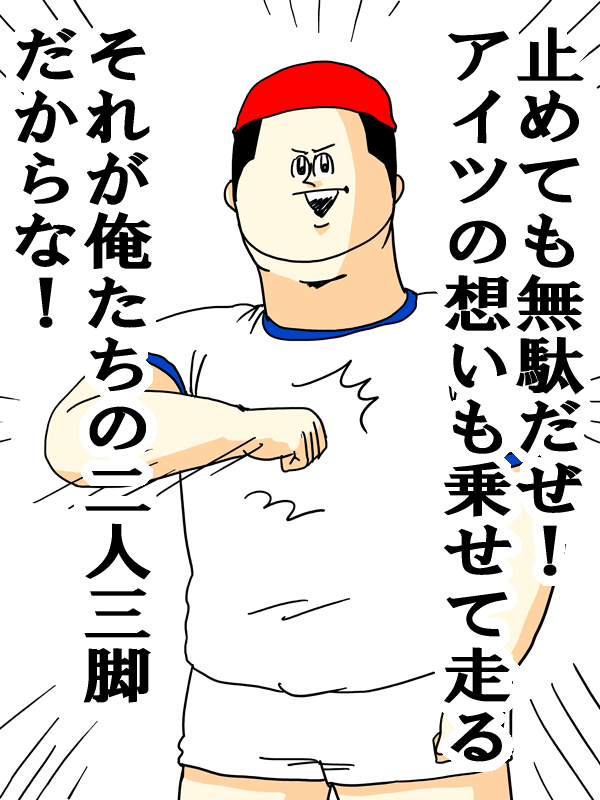

== タイトル1

=== 基本情報
* Hoge
** Hoge - Hoge
** Hoge - Fuga
*** Hoge - Fuga - Piyo

=== テーブル
[options="header"]
|=====
| タイトル１ | タイトル２
| piyopiyo   | ほげほげ
|=====

== タイトル2

=== ソース

.JSON
.....
{
  foo: "bar",
  baz: "baaaar"
}
.....

.ruby sample
----
require 'rake'

@hoge = 3
def fuga
  puts "サンプル"
end
----

=== サンプル図
.サムネイル

-----------

-----------

[ditaa]
----
                   +-------------+
                   | Asciidoctor |-------+
                   |  Diagram    |       |
                   +-------------+       | PNG out
                       ^                 |
                       | ditaa in        |
                       |                 v
 +--------+   +--------+----+    /----------------\
 |        | --+ Asciidoctor +--> |                |
 |  Text  |   +-------------+    |Beautiful output|
 |Document|   |   !magic!   |    |                |
 |     {d}|   |             |    |                |
 +---+----+   +-------------+    \----------------/
     :                                   ^
     |          Lots of work             |
     +-----------------------------------+
----

[graphviz, dot-example, svg]
----
digraph g {
    a -> b
    b -> c
    c -> d
    d -> a
}
----

